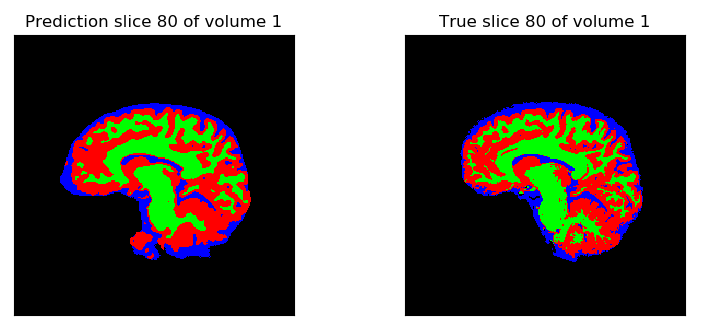

A crucial task in medicine is the analysis of medical images. This is traditionally done by radiologists. With the advent of better imaging techniques, there is more and more data created on each patient, which also means more data to be analyzed by radiologists. To reduce their workload and assist medical professionals, the tools of Artificial Intelligence can be used to analyse medical images.

This project focuses specifically on the analysis of MRI images of the brain. These images are taken in 3D, leading to a large collection of slices like the one below. We are interested in the segmentation of brain tissues. These tissues include white matter, grey matter and cerebrospinal fluid. To complete this task, we use a state of the art method called a **convolutional neural network**.

The main goal in image segmentation is to provide every individual pixel with a class label. In this case, the class label specifies whether white matter, grey matter or cerebrospinal fluid is present in the pixel. A popular implementation of this neural network is called **U-net**. The results are shown below in the image. 

This project was performed during my Master thesis in Physics, in which I performed an internship in the MRI department of the UZ Jette. I worked under the supervision of Peter Van Schuerbeek, Maarten Naeyaert en Hubert Raeymaekers. 

You can find the code of the project [here](https://github.com/Joeri38/brain-segmentation) and a full explanation in Dutch [here](https://joeri38.github.io/brain-segmentation-website/).
