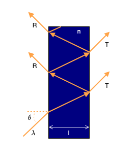

In the field of Photonics, optical components are created based on experience and domain knowledge. Creating complex structures with a high-dimensional design space is therefore often difficult. To overcome this problem, deep learning has been introduced in recent years. The neural networks of deep learning are applied in what we call inverse design. In this paradigm, we start from a desired optical response and try to retrieve a design of an optical device whose optical behaviour closely matches the target response. 

In my Master thesis in Physics at VUB, I applied this inverse design to the system of Fabry-Pérot. This system consists of a small dielectric wall in which light can reflect multiple times. These reflections lead to interference, and cause a transmission and reflection that are based on the wavelength of the incoming light. The inverse design question is the following: "For which values of angle \\( \theta \\), index of refraction \\( n \\) and thickness \\( l \\) of the material can we get the desired wavelength dependent transmission \\( T(\lambda) \\)?"

{: .center-block :}

To answer this question, we first train a neural network to learn the mapping between the 3 design parameters and the wavelength dependent transmission. The network is trained by showing it a lot of examples of design parameters and their corresponding transmission. Once this neural network is trained, we can use backpropagation on the design parameters to optimize for a target design. In this case we are minimizing the squared difference between the target prediction and the prediction by the neural network. This loss is given by

$$ L = \lvert T_{target}(\lambda) - T_{pred}(\lambda) \rvert^2. $$

In this way, we can match any target transmission to the closest transmission of a Fabry-Pérot resonator. To show that arbitrary transmissions can be designed, we applied this to the shape of an elephant.

The code for this project is available [here](https://github.com/Joeri38/inverse-design). My full thesis can be found on [arXiv](https://arxiv.org/abs/2202.03578). You can also read more about this in our paper with Hannah Pinson and Prof. Vincent Ginis.

> J. Lenaerts, H. Pinson, V. Ginis, "Artificial Neural Networks for inverse design of resonant nanophotonic components with oscillatory loss landscapes" (2021) Nanophotonics, (10)1, 385-392 [https://www.degruyter.com/view/journals/nanoph/ahead-of-print/article-10.1515-nanoph-2020-0379/article-10.1515-nanoph-2020-0379.xml](https://www.degruyter.com/view/journals/nanoph/ahead-of-print/article-10.1515-nanoph-2020-0379/article-10.1515-nanoph-2020-0379.xml)
