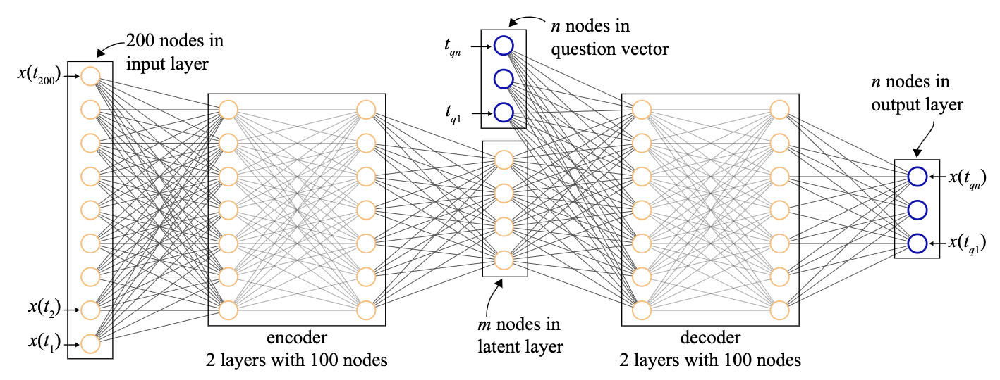
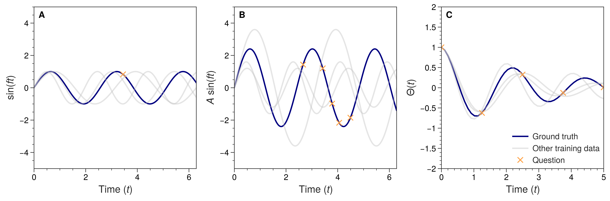
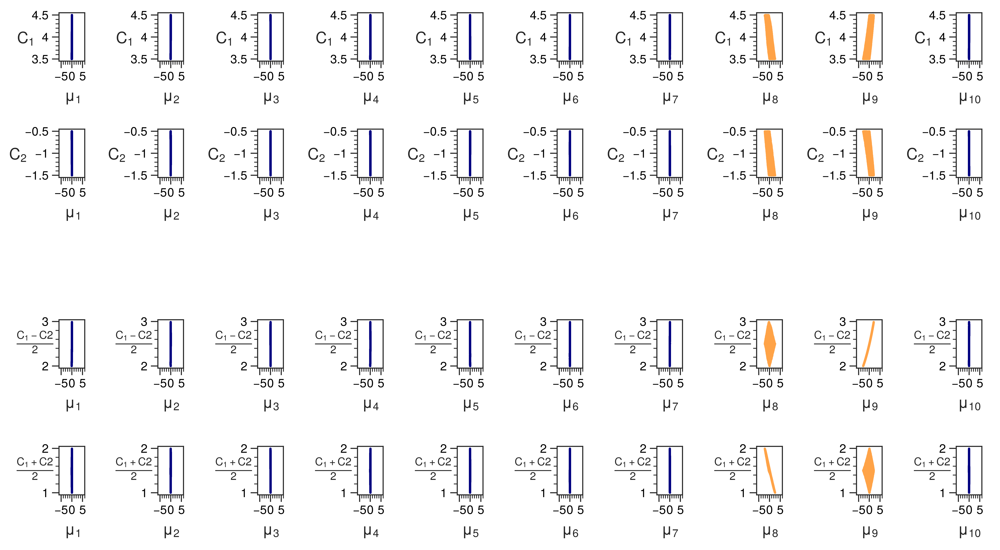

A crucial task in Physics is the extraction of degrees of freedom in a dynamical system. Recently, a neural network architecture was created to perform exactly this task. The architecture is called a &beta;-Variational Auto-Encoder (&#946;-VAE) and is illustrated the figure below. The original paper applied this to planetery orbits. The neural network was able to retrieve that the planets orbit the sun [1]. It achieved this by storing the angle of the planets with respect to the sun, the rele vant degrees of freedom, into a so-called latent space. What remained unclear however are two things. One is which architecture choices were fundamental in learning a latent representation. The second is why specifically these degrees of freedom were learned in the latent space, and not a function of them. We address these questions in this project. 

{: .center-block :}

We work on three datasets of analytical functions where the degrees of freedom are known. The datasets are shown in the figure below. The first is a dataset of a sine function where only the frequency changes, this is given by

$$ y = \sin(ft), \quad \text{for} \quad t \in [0, 2\pi]. $$

In this case, the one degree of freedom is the frequency \\( f \in [2, 3.5] \\). In the second dataset, also the amplitude is added as a degree of freedom. We get 

$$ y = A \sin(ft), \quad \text{for} \quad t \in [0, 2\pi]. $$

We now have two degrees of freedom, the frequency \\( f \in [2, 3.5] \\) and the amplitude \\( A \in [1, 3] \\). Finally, the third dataset is based on the analytical formula for a damped harmonic oscillator. We get

$$ \Theta(t) = \exp(-\frac{b}{2t}) \cos( \sqrt{ \kappa - \frac{b^2}{4} } t), \quad \text{for} \quad t \in [0, 5]. $$

The two degrees of freedom are \\( b \in [0.5, 1] \\) and \\( \kappa \in [5, 10] \\). For each dataset, we create 100 000 samples with different degrees of freedom.

When a \\( \beta \\)-VAE is applied to these datasets, a latent space will be formed where we want our degrees of freedom to appear. In all of our experiments, we chose a latent space with vectors \\( \mu \\) of dimension 10. To find out wheter a degree of freedom is learned, we compare the dimensions of the latent vector \\( \mu \\) with a particular degree of freedom and look for correlations. This is illustrated for the first dataset in the figure below. We want to retrieve the frequency \\( f \\) in this dataset. The two rows show two different latent spaces that were formed in different runs of the \\( \beta \\)-VAE. We can see in the first row that there is a linear correlation between \\( \mu_9 \\) and \\( f \\). This means that this latent dimension corresponds to the frequency \\( f \\) and the degree of freedom is retrieved. In the second row, information is stored in 4 latent dimensions. None of these dimensions show a clear correlation with \\( f \\), so we conclude that the degree offreedom is not retrieved. 

What was different in both runs of the \\( \beta \\)-VAE was the question that was asked in the network. As shown in the first figure, a question of different time points (\\( t_{q1}, ... t_{qn} \\)) is asked to the network, such that the output is the time series (\\(x(t_{q1}), ... x(t_{qn}) \\)). Two properties of this question influence the learning of a good latent space, namely

- the dimension \\(n \\) of the question
- the stochasticity of the question

We observed that in order to learn a good latent representation, the dimension \\( n \\) of the question should not be too large. Generally, less than 5. Furthermore, the question needs to be stochastic. This means that the time points (\\( t_{q1}, ... t_{qn} \\)) at which we ask the question should be random and different for every sample in our dataset. When a question suffices both conditions, low dimension and stochastic, a \\( \beta \\)-VAE is able to retrieve degrees of freedom in iets latent space. 

At last, there is no a priori reason why a specific degree of freedom should be learned in the latent space and not a linear combination of it. We studied this using a modified version of the second dataset. This modified dataset was formed by the formula

$$\frac{C_1 + C_2}{2} \sin( \frac{C_1 - C_2}{2} t), \quad \text{for} \quad t \in [0, 2\pi]. $$

The degrees of freedom are \\( C_1 \in [3.5, 4.5] \\) and \\( C_2 \in [-1.5, -0.5] \\). This is the same as the second dataset if we make the identifications

$$ \frac{C_1 + C_2}{2} = A, \quad \frac{C_1 - C_2}{2} = f. $$

We would expect that we would learn \\( C_1 \\) and \\( C_2 \\), since those were the parameters that we used to generate the dataset. It turns out however that the linear combinations \\( \frac{C_1 + C_2}{2} \\) and \\( \frac{C_1 - C_2}{2} \\) that correspond to \\( A \\) and \\( f \\) are learned instead. The correlations with both sets of parameters is shown in the figure below. The fact that \\( A \\) and \\( f \\) are learned can be explained by a symmetry argument [2]. The parameters \\( A \\) and \\( f \\) form what is called a **disentangled representation**. This is a representation such that the components transform independently under the subgroups of the symmetry group of the dataset. In this case, the dataset lives in 2D Euclidean space and the symmetry group are horizontal and vertical scalings. Two subgroups are horizontal scalings and verticla scalings. The horizontal scalings correspond to change in frequency \\( f \\) and the vertical scalings correspond to a change in amplitude \\( A \\). Both subgroups leave the other parameter unchanged. \\( A \\) and \\( f \\) thus form a disentangled representation under the symmetry group of scalings. We find thus that a \\( \beta \\)-VAE is able to find disentangled representations. 

In summary, we studied the conditions under which a \\( \beta \\)-VAE can learn the degrees of freedom of a physical system. We find that the question that appears in the neural network architecture is of crucial importance. The question (\\(t_{q1}, ... t_{qn} \\)) needs to be

- of low dimension \\( n \\),
- stochastic, meaning random and different for every sample in the dataset. 

If these conditions are met, the degrees of freedom can be retrieved in the latent space. This work sheds light on the internal workings of the \\( \beta \\)-VAE and its use in the physical sciences. We foresee a further use for automated knowledge discovery in the physical sciences empowered by Machine Learning. 

The code for this project is available [here](https://github.com/Joeri38/beta-VAE).

> Joeri Lenaerts and Vincent Ginis, "Questioning the question: exploring how physical degrees of freedom are retrieved with neural networks" (2022)  Physical Review Research, 4, 023206 [https://journals.aps.org/prresearch/abstract/10.1103/PhysRevResearch.4.023206](https://journals.aps.org/prresearch/abstract/10.1103/PhysRevResearch.4.023206)

References: 

> [1] R. Iten, T. Metger, H. Wilming, L. Del Rio, and R. Renner, *Discovering Physical Concepts with Neural Networks*, Physical Review Letters 124 (2020),
arXiv:1807.10300.

> [2] I. Higgins, D. Amos, D. Pfau, S. Racaniere, L. Matthey, D. Rezende, and A. Lerchner, *Towards a Definition of Disentangled Representations*, arXiv preprint (2018), arXiv:1812.02230.
